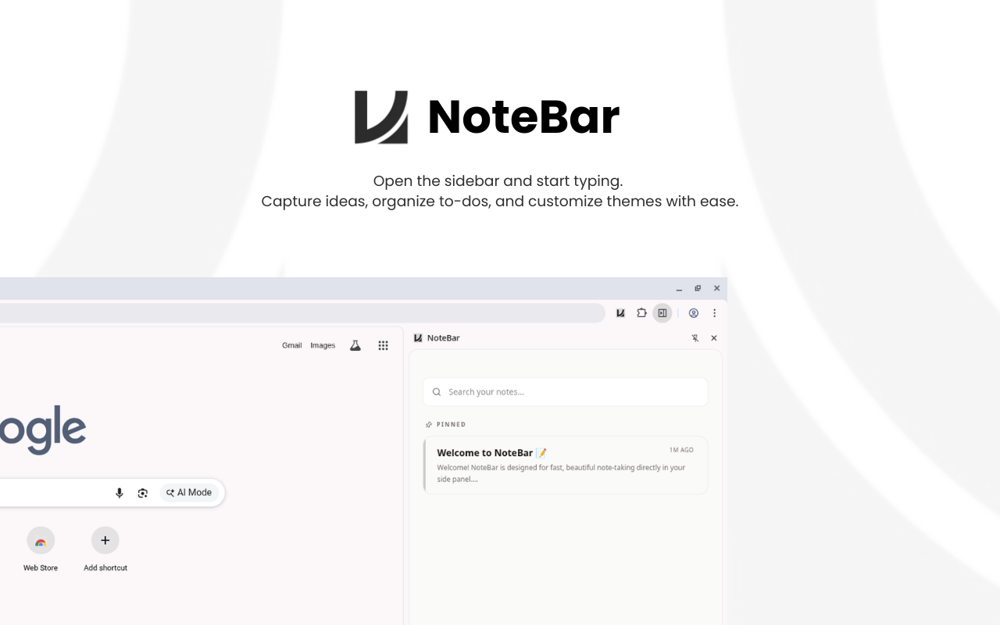
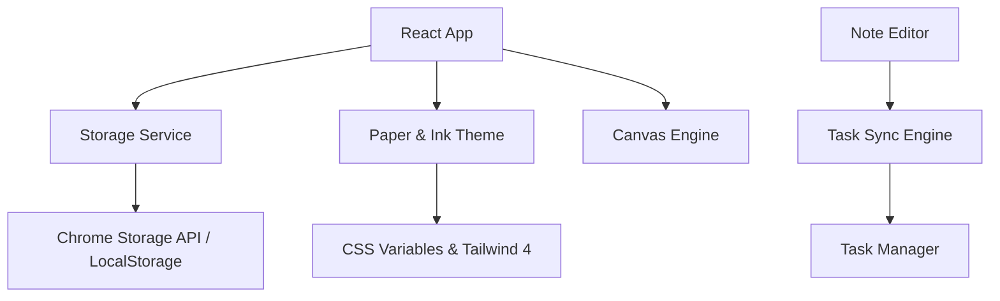

# 📝 NoteBar



<p align="center">
  
  
  
  
  
</p>

NoteBar is a premium, distraction-free note-taking and canvas sketching extension for your browser's side panel. Designed for speed, utility, and aesthetics, it helps you capture thoughts, sketch diagrams, manage tasks, and stay organized without ever leaving your current tab.

---

## 🚀 Why NoteBar?

In a world of bloated note apps, NoteBar focuses on **contextual productivity**. It lives right inside your browser side panel—providing a fast, elegant, and local-first space for your digital second brain.

- **Frictionless Experience**: Open the sidebar and start writing or drawing immediately.
- **Rich Text & Task Sync**: Full ProseMirror rich-text editor with automatic task synchronization.
- **Interactive Canvas**: High-DPI sketch canvas with visual color wheels, stroke weight controls, and PNG export.
- **Local-First Privacy**: Your data never leaves your browser. 100% offline, zero tracking, zero account requirement.
- **Paper & Ink Design System**: Clean, modern typography with fluid glassmorphism and theme modes.

---

## ✨ Key Features

- 📝 **Rich Note Editor**: Headings, bold, italic, code blocks, syntax highlighting, links, images, and task lists.
- 🎨 **Sketch Canvas & Gallery**: High-DPI drawing board with visual color swatches, customizable stroke weights, and Grid/List gallery views.
- ⚡ **Smart Task Manager**: Dedicated To-Do list that automatically synchronizes with task checkboxes in your notes.
- 🔍 **Instant Search & Tags**: Filter and search notes, tasks, and sketches in milliseconds.
- 💾 **Auto-Save & Local Backup**: Instant auto-saving via `chrome.storage.local` with full JSON import & export options.
- 📌 **Pin & Archive**: Pin important notes to the top and archive completed items.

---

## 📦 How to Load in Chrome (Extension Installation)

To use NoteBar in Chrome or any Chromium-based browser (Brave, Edge, Opera):

### Step 1: Build the Project
Open a terminal in the project directory and run:
```bash
npm install
npm run build
```
This compiles the code into a production-ready folder named **`dist`**.

### Step 2: Load into Chrome
1. Open Chrome and navigate to `chrome://extensions/` (or go to **Settings > Extensions**).
2. In the top-right corner, turn **ON** `Developer Mode`.
3. Click the **Load unpacked** button in the top-left header.
4. Select the **`dist`** folder located inside this project directory.
5. **NoteBar** is now installed! Click the puzzle icon on your toolbar and **pin NoteBar**.

---

## 🛠️ Architecture

NoteBar is built with a modular, resilient React 19 stack optimized for Chrome Extension performance.



- **Core**: React 19 + TypeScript + Vite
- **Editor**: Tiptap / ProseMirror
- **Styling**: Tailwind CSS 4 + Motion (for micro-animations)
- **Icons**: Lucide React
- **Storage**: `chrome.storage.local` (with safe fallback handling)

---

## 👩‍💻 Contributing

Contributions are welcome! To set up a local development environment:

```bash
# Clone the repository
git clone https://github.com/DanielAbabu/notebar.git

# Install dependencies
npm install

# Run Vite dev server
npm run dev

# Run TypeScript linter
npm run lint

# Build extension
npm run build
```

---

## 📄 License

This project is licensed under the **MIT License** - see the [LICENSE](LICENSE) file for details.

---

Built with ❤️ by [Daniel Ababu](https://github.com/DanielAbabu)
